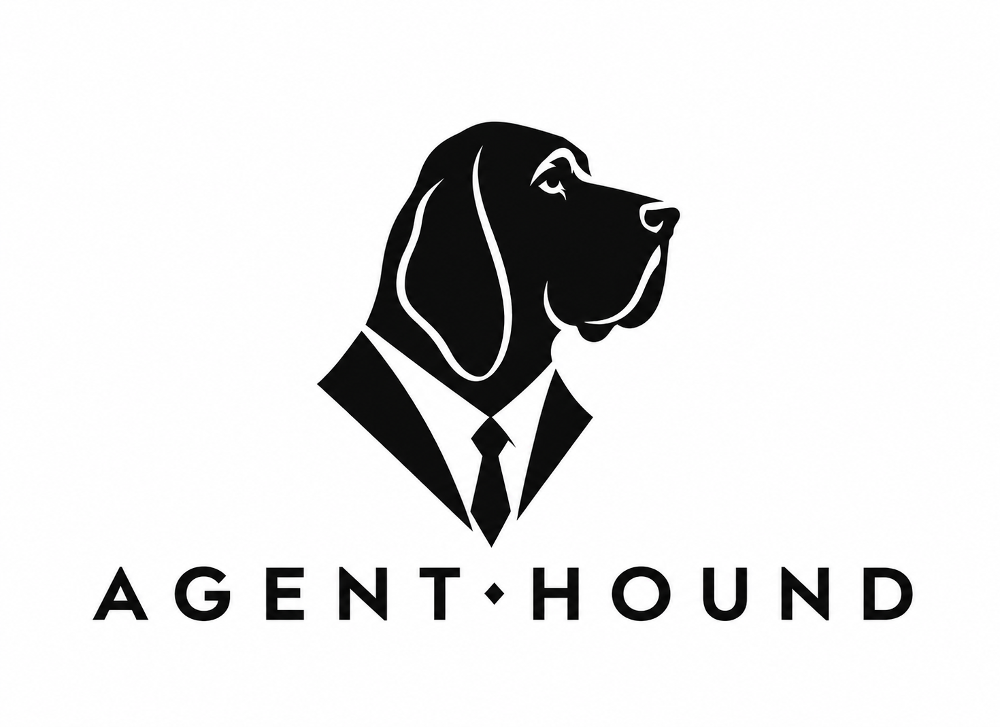
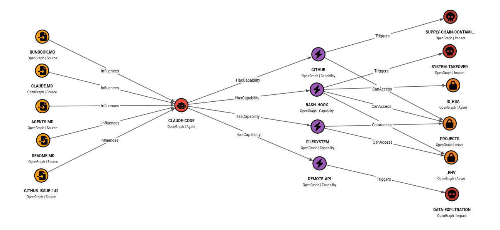

# Agent-Hound 

<p align="center">
  
</p>

**Discover the Attack Paths Created by AI Agents.**

**Agent-Hound** maps potential **Indirect Prompt Injection (IPI)** attack paths in AI agent environments such as Claude Code and Claude Desktop. It builds a graph from agent configuration, local source files, sensitive file locations, and connectivity checks so you can inspect where untrusted inputs meet privileged capabilities.

Built on the [SpecterOps OpenGraph](https://specterops.io/opengraph/) specification, Agent-Hound produces JSON for [BloodHound CE](https://bloodhound.specterops.io/) File Ingest, letting you visualize potential attack paths and query them with Cypher.

---

## The Concept: Source-to-Impact

An AI agent working in your project reads a lot: `README.md`, `CLAUDE.md`, `AGENTS.md`, open GitHub issues, runbooks. Any of these can carry a hidden instruction planted by an attacker — this is **Indirect Prompt Injection**. On its own, that's just text. The danger is what the agent can *do* from there.

That same agent may have shell access, can push to git, can make outbound HTTP requests, and can read files like `~/.ssh/id_rsa` or `.env`. A poisoned source becomes the first step of a full attack chain — ending in data exfiltration, system takeover, or supply chain contamination.

Agent-Hound models this chain as five interconnected node types, producing a graph you can explore in BloodHound:

<p align="center">
  
</p>

| Node | Role | Examples |
| :--- | :--- | :--- |
| **Source** | Local files that could influence an agent | `README.md`, `CLAUDE.md`, `AGENTS.md` |
| **Agent** | Agent environment identified from its configuration | Claude Code, Codex|
| **Capability** | Configured MCP servers and command hooks | `filesystem`, `github`, `hook:PreToolUse:Bash` |
| **Asset** | Discovered sensitive files and source repositories | `~/.ssh/id_rsa`, `.env`, a local Git repository |
| **Impact** | Potential consequences inferred from capabilities and environment checks | `System-Takeover`, `Internet-Exfiltration`, `Supply-Chain-Contamination` |

**Edges:** `Influences` (Source → Agent) · `HasCapability` (Agent → Capability) · `CanAccess` (Capability → Asset) · `Triggers` (Capability → Impact)

### Facts vs. guesses

BloodHound is built to show verified access facts, so Agent-Hound is explicit about how sure it is. Every derived `CanAccess` / `Triggers` edge carries two properties you can query in BloodHound:

* `confidence` — `confirmed` when the claim comes from a fact in the config (a known MCP package such as `@modelcontextprotocol/server-filesystem`, a shell binary, a hook definition), `suspected` when it comes from a name-based heuristic only.
* `evidence` — what produced the edge, e.g. `package:@modelcontextprotocol/server-github (push_files / create_or_update_file via GitHub API)` or `keyword:file`.

Known packages are matched against a verified capability registry (`src/agenthound/discovery/profiles.py`), and `server-filesystem`-style allowed directories restrict `CanAccess` to assets inside those directories.

```cypher
MATCH p=()-[r:CanAccess|Triggers]->() WHERE r.confidence = 'confirmed' RETURN p
```

---

## Exploring Potential Attack Scenarios

The following scenarios illustrate how to interpret the graph. Agent-Hound identifies conditions that could enable an attack; it does not detect malicious instructions, execute payloads, or verify that an exploit succeeds.

### Shell Execution via Malicious Instructions

* **The Threat:** Malicious `.cursorrules` or instructions in a repo tricking an agent into executing shell commands.
* **Hound Path:** `Source: README.md` → `Agent` → `Capability: shell-capable MCP server or command hook` → `Impact: SYSTEM-TAKEOVER`.
* **Inference:** A configured command hook or MCP server classified as shell-capable produces a potential system-takeover impact. This does not establish that source content can control the command or bypass approval.

### Data Exfiltration

* **The Threat:** An IPI forcing the agent to leak secrets via a hidden web request.
* **Hound Path:** `Source: README.md` → `Agent` → `Capability: remote` → `Impact: INTERNET-EXFILTRATION`. Inspect `CanAccess` branches separately for potential access to secrets such as `.env`.
* **Inference:** A capability whose name or command matches network keywords, together with a successful outbound connectivity check, produces a potential exfiltration impact. It does not confirm that the same capability can read a secret or reach an attacker's endpoint. GitHub Issues are a conceptual IPI source, but the current CLI does not fetch them.

### Supply Chain Contamination

* **The Threat:** AI agents writing backdoored code because they trusted a malicious project doc.
* **Hound Path:** `Source: CLAUDE.md` → `Agent` → `Capability: github` → `Impact: SUPPLY-CHAIN-CONTAMINATION`.
* **Inference:** A capability whose name or command contains `git`, together with a discovered local repository that has a configured remote, produces a potential supply-chain impact. Repository write permissions, authentication, branch protections, and the ability to push are not verified.

---


## Usage

### Installation

Requires **Python 3.10+**. From the root of a local checkout:

```bash
python -m venv .venv
source .venv/bin/activate
python -m pip install .
agenthound --help
```

On Windows, activate the virtual environment with `.venv\Scripts\Activate.ps1` in PowerShell.

### CLI Summary

Select a configuration file and explicitly specify the project workspace. For Claude Desktop (the config path below is the Linux path recognized by the collector):

```bash
agenthound --config ~/.config/Claude/claude_desktop_config.json \
  --workspace /srv/myproject --scope all -o output.json -v
```

The collector also recognizes `~/Library/Application Support/Claude/claude_desktop_config.json` on macOS and `%APPDATA%\Claude\claude_desktop_config.json` on Windows. Use the path to your actual config file and quote paths containing spaces.

For Claude Code:

```bash
agenthound --config ~/.claude/settings.json \
  --workspace /srv/myproject --scope all -o output.json -v
```

Each command reads the specified file; it does not merge other agent configuration files. To scan configurations found at the collector's predefined discovery locations:

```bash
agenthound discover --workspace /srv/myproject --scope all -o output.json -v
```

| Scope | Source collection | Asset collection |
| :--- | :--- | :--- |
| `workspace` | Selected workspace | Selected workspace |
| `global` | Skipped | Known credential directories and top-level sensitive files in the home directory |
| `all` (default) | Selected workspace | Workspace plus global asset locations |

Configuration parsing and the connectivity check run for every scope. Without `--workspace`, the workspace defaults to the current directory.

Illustrative output (counts and findings depend on your configuration and files):

```text
$ agenthound --config ~/.config/Claude/claude_desktop_config.json --workspace /srv/myproject --scope all -o output.json -v

Agent-Hound v0.1.0

        Scope Summary
┏━━━━━━━━━━━━━━━┳━━━━━━━━━━━━━━━━━━━━━━━━━━┓
┃ Pillar        ┃ Scanning                 ┃
┡━━━━━━━━━━━━━━━╇━━━━━━━━━━━━━━━━━━━━━━━━━━┩
│ Capabilities  │ claude_desktop_config.json│
│ Sources       │ /srv/myproject           │
│ Assets        │ home dir + /srv/myproject │
│ Impact        │ connectivity=reachable + shell + git│
└───────────────┴───────────────────────────┘

Output written to output.json
  Nodes: 9 | Edges: 11

Security Findings:
  3 IPI source(s): README.md, CLAUDE.md, notes.txt
  2 asset(s) reachable via shell capability
  Exfiltration path detected: internet is reachable
```

The CLI's `IPI source(s)` message lists candidate input files, and `Exfiltration path detected` reports an inferred risk condition. Neither message confirms malicious content or an actual data leak.

### Importing to BloodHound

1. Run Agent-Hound to generate `output.json`.
2. Open **BloodHound CE** (v8.0+).
3. Use **File Ingest** to upload the JSON.
4. Run Cypher queries to find paths:
   ```cypher
   MATCH p=(s:Source)-[*]->(i:Impact) RETURN p
   ```

See [query.md](query.md) for node properties, edge types, asset reachability, exfiltration paths, and capability choke-point queries. For a graph preview without a live scan, the repository includes [sample output](examples/sample_output.json) and a [demo graph](examples/demo.json); these files are examples, not findings about your environment.

---

## Disclaimer

**For Authorized Security Testing Only.**

Agent-Hound is designed to assist security professionals and developers in identifying potential risks in AI agent configurations. The creator assumes no liability for any misuse of this tool. Mapping an attack path does not guarantee an exploit is possible, nor does the absence of a path guarantee absolute security. Use with caution in production environments.

---

## License

MIT

---
