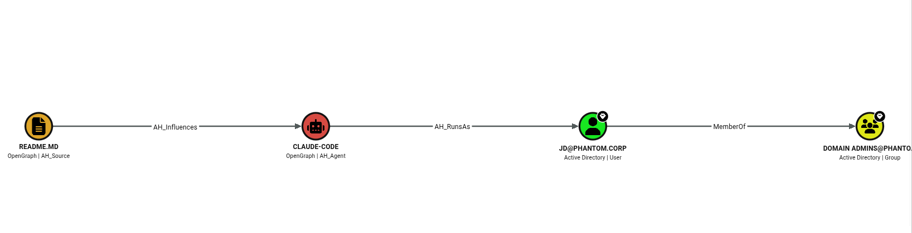

# Agent-Hound 

<p align="center">
  
</p>

<p align="center"><strong>Discover Attack Paths in AI Agent Environments.</strong></p>

<p align="center">
  <a href="https://bloodhound.specterops.io/opengraph/overview"></a>
  <a href="#graph-model"></a>
  <a href="https://www.python.org/"></a>
  <a href="LICENSE"></a>
</p>

**Agent-Hound** maps potential **Indirect Prompt Injection (IPI)** attack paths in AI agent environments such as Claude Code and Codex. It builds a graph from agent configuration, local source files, sensitive file locations, and connectivity checks so you can inspect where untrusted inputs meet privileged capabilities.

Built on the [SpecterOps OpenGraph](https://specterops.io/opengraph/) specification, Agent-Hound produces JSON for [BloodHound CE](https://bloodhound.specterops.io/) File Ingest, letting you visualize potential attack paths and query them with Cypher.

---

## Graph Model

Agent-Hound models AI agent environments as five node types connected by four edge types, then exports the graph to BloodHound OpenGraph:

<p align="center">
  
</p>

| Node | Role | Examples |
| :--- | :--- | :--- |
| **Source** | Local files that could influence an agent | `README.md`, `CLAUDE.md`, `AGENTS.md` |
| **Agent** | Agent environment identified from its configuration | Claude Code, Codex |
| **Capability** | Configured MCP servers, command hooks, and supported built-in tools | `filesystem`, `github`, `Read`, `Bash` |
| **Asset** | Discovered sensitive files and source repositories | `~/.ssh/id_rsa`, `.env`, a local Git repository |
| **Impact** | Potential consequences inferred from capabilities and environment checks | `System-Takeover`, `Internet-Exfiltration`, `Supply-Chain-Contamination` |

**Edges:** `Influences` (Source → Agent) · `HasCapability` (Agent → Capability) · `CanAccess` (Capability → Asset) · `Triggers` (Capability → Impact)

---


## Usage

### Installation

Requires **Python 3.10+**. From the root of a local checkout:

```bash
python -m venv .venv
source .venv/bin/activate
python -m pip install .
agenthound --help
```

### Scan a Project

```bash
cd /path/to/project
agenthound discover -o output.json -v
```

`discover` automatically reads supported configuration files from the home directory and project. For additional options, run `agenthound --help` or `agenthound discover --help`.

### Import into BloodHound

Open **BloodHound CE** (v8.0+), go to **File Ingest**, and upload the generated OpenGraph JSON. Explore the graph using Search or Cypher.

See [query.md](query.md) for example Cypher queries. For a graph preview without a live scan, see the [sample output](examples/sample_output.json) and [demo graph](examples/demo.json).

## Connecting to an AD Graph

Connect Agent-Hound's OpenGraph data to an AD graph in BloodHound and trace paths from AI agent environments to AD users, computers, and groups. See the [AD integration guide](docs/ad-integration.md).

<p align="center">
  
</p>

---

## Disclaimer

**For Authorized Security Testing Only.**

Agent-Hound is designed to assist security professionals and developers in identifying potential risks in AI agent configurations. The creator assumes no liability for any misuse of this tool. Mapping an attack path does not guarantee an exploit is possible, nor does the absence of a path guarantee absolute security. Use with caution in production environments.

---

## License

MIT

---
